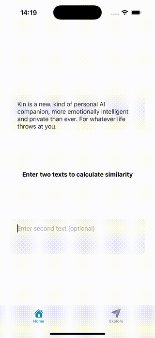

<span>
  
  
  
</span>

## 🌍 Übersetzungen

🇬🇧 [English](README.md) | 🇪🇸 [Español](README.es.md) | 🇫🇷 [Français](README.fr.md) | 🇨🇳 [中文](README.zh.md) | 🇯🇵 [日本語](README.ja.md) | 🇮🇳 [हिंदी](README.hi.md) | 🇩🇪 Deutsch
<br/>

Plattformübergreifendes Framework zur lokalen Bereitstellung von LLM/VLM/TTS-Modellen in Ihrer App.

- Verfügbar in Flutter, React-Native und Kotlin Multiplatform.
- Unterstützt jedes GGUF-Modell, das Sie auf Huggingface finden können; Qwen, Gemma, Llama, DeepSeek etc.
- Führen Sie LLMs, VLMs, Embedding-Modelle, TTS-Modelle und mehr aus.
- Unterstützt von FP32 bis hin zu 2-Bit-quantisierten Modellen für Effizienz und weniger Gerätebelastung.
- Chat-Templates mit Jinja2-Unterstützung und Token-Streaming.

[KLICKEN SIE, UM UNSEREM DISCORD BEIZUTRETEN!](https://discord.gg/bNurx3AXTJ)
<br/>
<br/>
[KLICKEN SIE ZUR VISUALISIERUNG UND ABFRAGE DES REPOS](https://repomapr.com/cactus-compute/cactus)

## 

1.  **Installation:**
    Führen Sie den folgenden Befehl in Ihrem Projekt-Terminal aus:
    ```bash
    flutter pub add cactus
    ```
2. **Flutter Textvervollständigung**
    ```dart
    import 'package:cactus/cactus.dart';

    final lm = await CactusLM.init(
        modelUrl: 'huggingface/gguf/link',
        contextSize: 2048,
    );

    final messages = [ChatMessage(role: 'user', content: 'Hallo!')];
    final response = await lm.completion(messages, maxTokens: 100, temperature: 0.7);
    ```
3. **Flutter Embedding**
    ```dart
    import 'package:cactus/cactus.dart';

    final lm = await CactusLM.init(
        modelUrl: 'huggingface/gguf/link',
        contextSize: 2048,
        generateEmbeddings: true,
    );

    final text = 'Ihr Text zum Einbetten';
    final result = await lm.embedding(text);
    ```
4. **Flutter VLM Vervollständigung**
    ```dart
    import 'package:cactus/cactus.dart';

    final vlm = await CactusVLM.init(
        modelUrl: 'huggingface/gguf/link',
        mmprojUrl: 'huggingface/gguf/mmproj/link',
    );

    final messages = [ChatMessage(role: 'user', content: 'Beschreiben Sie dieses Bild')];

    final response = await vlm.completion(
        messages, 
        imagePaths: ['/absoluter/pfad/zum/bild.jpg'],
        maxTokens: 200,
        temperature: 0.3,
    );
    ```
5. **Flutter Cloud-Fallback**
    ```dart
    import 'package:cactus/cactus.dart';

    final lm = await CactusLM.init(
        modelUrl: 'huggingface/gguf/link',
        contextSize: 2048,
        cactusToken: 'enterprise_token_here', 
    );

    final messages = [ChatMessage(role: 'user', content: 'Hallo!')];
    final response = await lm.completion(messages, maxTokens: 100, temperature: 0.7);

    // local (Standard): strikt nur auf dem Gerät ausführen
    // localfirst: Fallback zur Cloud bei Geräteausfall
    // remotefirst: primär remote, lokal ausführen bei API-Ausfall
    // remote: strikt in der Cloud ausführen
    final embedding = await lm.embedding('Ihr Text', mode: 'localfirst');
    ```

  Hinweis: Siehe die [Flutter Dokumentation](https://github.com/cactus-compute/cactus/blob/main/flutter) für mehr Informationen.

## 

1.  **Installieren Sie das `cactus-react-native` Paket:**
    ```bash
    npm install cactus-react-native && npx pod-install
    ```

2. **React-Native Textvervollständigung**
    ```typescript
    import { CactusLM } from 'cactus-react-native';
    
    const { lm, error } = await CactusLM.init({
        model: '/pfad/zum/model.gguf',
        n_ctx: 2048,
    });

    const messages = [{ role: 'user', content: 'Hallo!' }];
    const params = { n_predict: 100, temperature: 0.7 };
    const response = await lm.completion(messages, params);
    ```
3. **React-Native Embedding**
    ```typescript
    import { CactusLM } from 'cactus-react-native';
    
    const { lm, error } = await CactusLM.init({
        model: '/pfad/zum/model.gguf',
        n_ctx: 2048,
        embedding: true,
    });

    const text = 'Ihr Text zum Einbetten';
    const params = { normalize: true };
    const result = await lm.embedding(text, params);
    ```

4. **React-Native VLM**
    ```typescript
    import { CactusVLM } from 'cactus-react-native';

    const { vlm, error } = await CactusVLM.init({
        model: '/pfad/zum/vision-model.gguf',
        mmproj: '/pfad/zum/mmproj.gguf',
    });

    const messages = [{ role: 'user', content: 'Beschreiben Sie dieses Bild' }];

    const params = {
        images: ['/absoluter/pfad/zum/bild.jpg'],
        n_predict: 200,
        temperature: 0.3,
    };

    const response = await vlm.completion(messages, params);
    ```
5. **React-Native Cloud-Fallback**
    ```typescript
    import { CactusLM } from 'cactus-react-native';

    const { lm, error } = await CactusLM.init({
        model: '/pfad/zum/model.gguf',
        n_ctx: 2048,
    }, undefined, 'enterprise_token_here');

    const messages = [{ role: 'user', content: 'Hallo!' }];
    const params = { n_predict: 100, temperature: 0.7 };
    const response = await lm.completion(messages, params);

    // local (Standard): strikt nur auf dem Gerät ausführen
    // localfirst: Fallback zur Cloud bei Geräteausfall
    // remotefirst: primär remote, lokal ausführen bei API-Ausfall
    // remote: strikt in der Cloud ausführen
    const embedding = await lm.embedding('Ihr Text', undefined, 'localfirst');
    ```
Hinweis: Siehe die [React Dokumentation](https://github.com/cactus-compute/cactus/blob/main/react) für mehr Informationen.

## 

1.  **Maven-Abhängigkeit hinzufügen:**
    Zu Ihrem KMP-Projekt `build.gradle.kts` hinzufügen:
    ```kotlin
    kotlin {
        sourceSets {
            commonMain {
                dependencies {
                    implementation("com.cactus:library:0.2.4")
                }
            }
        }
    }
    ```

2. **Plattform-Setup:**
    - **Android:** Funktioniert automatisch - native Bibliotheken enthalten.
    - **iOS:** In Xcode: File → Add Package Dependencies → `https://github.com/cactus-compute/cactus` einfügen → Add klicken

3. **Kotlin Multiplatform Textvervollständigung**
    ```kotlin
    import com.cactus.CactusLM
    import kotlinx.coroutines.runBlocking
    
    runBlocking {
        val lm = CactusLM(
            threads = 4,
            contextSize = 2048,
            gpuLayers = 0 // Auf 99 für vollständige GPU-Auslagerung setzen
        )
        
        val downloadSuccess = lm.download(
            url = "pfad/zum/hugginface/gguf",
            filename = "model_filename.gguf"
        )
        val initSuccess = lm.init("qwen3-600m.gguf")
        
        val result = lm.completion(
            prompt = "Hallo!",
            maxTokens = 100,
            temperature = 0.7f
        )
    }
    ```

4. **Kotlin Multiplatform Spracherkennung**
    ```kotlin
    import com.cactus.CactusSTT
    import kotlinx.coroutines.runBlocking
    
    runBlocking {
        val stt = CactusSTT(
            language = "de-DE",
            sampleRate = 16000,
            maxDuration = 30
        )
        
        // Unterstützt nur Standard-Vosk STT-Modell für Android und Apple Foundation Model
        val downloadSuccess = stt.download()
        val initSuccess = stt.init()
        
        val result = stt.transcribe()
        result?.let { sttResult ->
            println("Transkribiert: ${sttResult.text}")
            println("Vertrauen: ${sttResult.confidence}")
        }
        
        // Oder aus Audiodatei transkribieren
        val fileResult = stt.transcribeFile("/pfad/zum/audio.wav")
    }
    ```

5. **Kotlin Multiplatform VLM**
    ```kotlin
    import com.cactus.CactusVLM
    import kotlinx.coroutines.runBlocking
    
    runBlocking {
        val vlm = CactusVLM(
            threads = 4,
            contextSize = 2048,
            gpuLayers = 0 // Auf 99 für vollständige GPU-Auslagerung setzen
        )
        
        val downloadSuccess = vlm.download(
            modelUrl = "pfad/zum/hugginface/gguf",
            mmprojUrl = "pfad/zum/hugginface/mmproj/gguf",
            modelFilename = "model_filename.gguf",
            mmprojFilename = "mmproj_filename.gguf"
        )
        val initSuccess = vlm.init("smolvlm2-500m.gguf", "mmproj-smolvlm2-500m.gguf")
        
        val result = vlm.completion(
            prompt = "Beschreiben Sie dieses Bild",
            imagePath = "/pfad/zum/bild.jpg",
            maxTokens = 200,
            temperature = 0.3f
        )
    }
    ```

  Hinweis: Siehe die [Kotlin Dokumentation](https://github.com/cactus-compute/cactus/blob/main/kotlin) für mehr Informationen.

## 

Das Cactus-Backend ist in C/C++ geschrieben und kann direkt auf Telefonen, Smart-TVs, Uhren, Lautsprechern, Kameras, Laptops usw. ausgeführt werden. Siehe die [C++ Dokumentation](https://github.com/cactus-compute/cactus/blob/main/cpp) für mehr Informationen.

## 

Zuerst klonen Sie das Repo mit `git clone https://github.com/cactus-compute/cactus.git`, wechseln Sie hinein und machen Sie alle Skripte ausführbar mit `chmod +x scripts/*.sh`

1. **Flutter**
    - Erstellen Sie die Android JNILibs mit `scripts/build-flutter-android.sh`.
    - Erstellen Sie das Flutter Plugin mit `scripts/build-flutter.sh`. (MUSS vor der Beispielnutzung ausgeführt werden)
    - Navigieren Sie zur Beispiel-App mit `cd flutter/example`.
    - Öffnen Sie Ihren Simulator über Xcode oder Android Studio, [Anleitung](https://medium.com/@daspinola/setting-up-android-and-ios-emulators-22d82494deda) falls Sie dies noch nicht getan haben.
    - Starten Sie die App immer mit dieser Kombination `flutter clean && flutter pub get && flutter run`.
    - Spielen Sie mit der App und nehmen Sie Änderungen an der Beispiel-App oder dem Plugin nach Belieben vor.

2. **React Native**
    - Erstellen Sie die Android JNILibs mit `scripts/build-react-android.sh`.
    - Erstellen Sie das Flutter Plugin mit `scripts/build-react.sh`.
    - Navigieren Sie zur Beispiel-App mit `cd react/example`.
    - Richten Sie Ihren Simulator über Xcode oder Android Studio ein, [Anleitung](https://medium.com/@daspinola/setting-up-android-and-ios-emulators-22d82494deda) falls Sie dies noch nicht getan haben.
    - Starten Sie die App immer mit dieser Kombination `yarn && yarn ios` oder `yarn && yarn android`.
    - Spielen Sie mit der App und nehmen Sie Änderungen an der Beispiel-App oder dem Paket nach Belieben vor.
    - Derzeit würden Sie bei Änderungen am Paket die Dateien/Ordner manuell in `examples/react/node_modules/cactus-react-native` kopieren.

3. **Kotlin Multiplatform**
    - Erstellen Sie die Android JNILibs mit `scripts/build-flutter-android.sh`. (Flutter und Kotlin teilen sich dieselben JNILibs)
    - Erstellen Sie die Kotlin-Bibliothek mit `scripts/build-kotlin.sh`. (MUSS vor der Beispielnutzung ausgeführt werden)
    - Navigieren Sie zur Beispiel-App mit `cd kotlin/example`.
    - Öffnen Sie Ihren Simulator über Xcode oder Android Studio, [Anleitung](https://medium.com/@daspinola/setting-up-android-and-ios-emulators-22d82494deda) falls Sie dies noch nicht getan haben.
    - Starten Sie die App immer mit `./gradlew :composeApp:run` für Desktop oder verwenden Sie Android Studio/Xcode für mobile Geräte.
    - Spielen Sie mit der App und nehmen Sie Änderungen an der Beispiel-App oder der Bibliothek nach Belieben vor.

4. **C/C++**
    - Navigieren Sie zur Beispiel-App mit `cd cactus/example`.
    - Es gibt mehrere Haupt-Dateien `main_vlm, main_llm, main_embed, main_tts`.
    - Erstellen Sie sowohl die Bibliotheken als auch die ausführbare Datei mit `build.sh`.
    - Führen Sie mit einer der ausführbaren Dateien aus `./cactus_vlm`, `./cactus_llm`, `./cactus_embed`, `./cactus_tts`.
    - Probieren Sie verschiedene Modelle aus und nehmen Sie nach Belieben Änderungen vor.

5. **Beitragen**
    - Um einen Bugfix beizutragen, erstellen Sie nach Ihren Änderungen einen Branch mit `git checkout -b <branch-name>` und reichen Sie einen PR ein.
    - Um ein Feature beizutragen, erstellen Sie bitte zuerst ein Issue, damit es diskutiert werden kann, um Überschneidungen mit anderen zu vermeiden.
    - [Treten Sie unserem Discord bei](https://discord.gg/SdZjmfWQ)

## 

| Gerät                         |  Gemma3 1B Q4 (Token/Sek) |    Qwen3 4B Q4 (Token/Sek)   |  
|:------------------------------|:------------------------:|:---------------------------:|
| iPhone 16 Pro Max             |            54            |             18              |
| iPhone 16 Pro                 |            54            |             18              |
| iPhone 16                     |            49            |             16              |
| iPhone 15 Pro Max             |            45            |             15              |
| iPhone 15 Pro                 |            45            |             15              |
| iPhone 14 Pro Max             |            44            |             14              |
| OnePlus 13 5G                 |            43            |             14              |
| Samsung Galaxy S24 Ultra      |            42            |             14              |
| iPhone 15                     |            42            |             14              |
| OnePlus Open                  |            38            |             13              |
| Samsung Galaxy S23 5G         |            37            |             12              |
| Samsung Galaxy S24            |            36            |             12              |
| iPhone 13 Pro                 |            35            |             11              |
| OnePlus 12                    |            35            |             11              |
| Galaxy S25 Ultra              |            29            |             9               |
| OnePlus 11                    |            26            |             8               |
| iPhone 13 mini                |            25            |             8               |
| Redmi K70 Ultra               |            24            |             8               |
| Xiaomi 13                     |            24            |             8               |
| Samsung Galaxy S24+           |            22            |             7               |
| Samsung Galaxy Z Fold 4       |            22            |             7               |
| Xiaomi Poco F6 5G             |            22            |             6               |

## 

|  | <a href="https://apps.apple.com/gb/app/cactus-chat/id6744444212"></a><br/><a href="https://play.google.com/store/apps/details?id=com.rshemetsubuser.myapp&pcampaignid=web_share"></a> |
| --- | --- |

|  |  |
| --- | --- |

## 
Wir bieten eine Sammlung empfohlener Modelle auf unserer [HuggingFace-Seite](https://huggingface.co/Cactus-Compute?sort_models=alphabetical#models)
